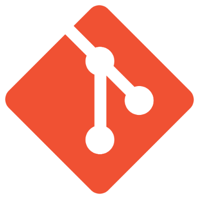

<!-- ### Hi there 👋 -->

<!--
**maggiechew/maggiechew** is a ✨ _special_ ✨ repository because its `README.md` (this file) appears on your GitHub profile.

Here are some ideas to get you started:

- 🔭 I’m currently working on ...
- 🌱 I’m currently learning ...
- 👯 I’m looking to collaborate on ...
- 🤔 I’m looking for help with ...
- 💬 Ask me about ...
- 📫 How to reach me: ...
- 😄 Pronouns: ...
- ⚡ Fun fact: ...
-->

<!--

-->
<!-- "Hero" Header -->

  
  
<!--    -->

<!-- Icons -->

 
 
 

<!-- Social -->
<table width="100%" align="center">
<tr>
<td align="center">
<a href="https://maggiechew.com">
<strong>Visit my personal website </strong>
 
 
 

</a>

</td>

<td align="center">
<a href="https://www.linkedin.com/in/maggie-chew-00226273/">
<strong>Find me on Linkedin</strong>
 
 

 
</a>

</td>
</tr>
</table>
 

 
 

<!-- Guestbook -->
| Name | Date | Message |
|---|---|---|
| <a href="https://github.com/danibarker"> danibarker</a> |2/4/2023, 7:40:45 PM|Dani was here|
| <a href="https://github.com/yanliu1111"> yanliu1111</a> |2/4/2023, 6:25:45 PM|Hello, could we have a coffee chat. 😘|
| <a href="https://github.com/maggiechew"> maggiechew</a> |2/4/2023, 6:22:22 AM|Test test|
<!-- /Guestbook -->

<!-- Footer -->

 

